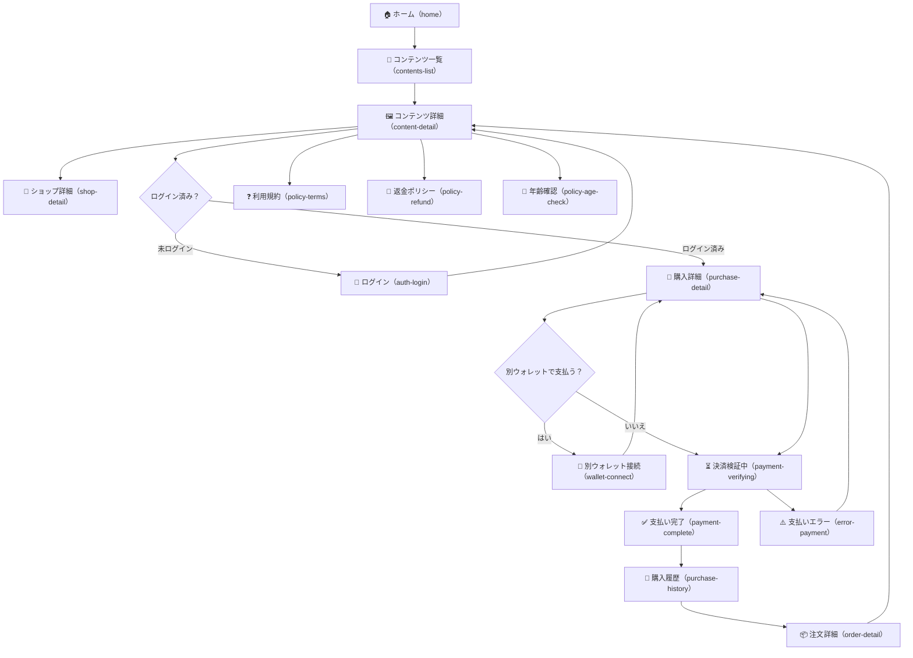

```mermaid
graph TD
  %% ===== 購入者フロー（App） =====
  A[🏠 ホーム（home）] --> B[🔎 コンテンツ一覧（contents-list）]
  B --> C[🖼️ コンテンツ詳細（content-detail）]

  %% コンテンツ詳細 → ショップ詳細
  C --> S[🏪 ショップ詳細（shop-detail）]

  %% ログイン分岐
  C --> D{ログイン済み？}
  D -- 未ログイン --> L[🔐 ログイン（auth-login）]
  L --> C
  D -- ログイン済み --> E[🧾 購入詳細（purchase-detail）]

  %% 別ウォレットは任意
  E --> F{別ウォレットで支払う？}
  F -- はい --> W[🔗 別ウォレット接続（wallet-connect）]
  W --> E
  F -- いいえ --> V[⏳ 決済検証中（payment-verifying）]

  %% 支払い実行は購入詳細内→検証へ
  E --> V[⏳ 決済検証中（payment-verifying）]

  %% 完了→履歴→詳細
  V --> I[✅ 支払い完了（payment-complete）]
  I --> H[🧾 購入履歴（purchase-history）]
  H --> O[📦 注文詳細（order-detail）]
  O --> C

  %% 補助導線（ポリシー/年齢）
  C --> T[❓ 利用規約（policy-terms）]
  C --> R[💬 返金ポリシー（policy-refund）]
  C --> Q[🔞 年齢確認（policy-age-check）]

  %% エラールート
  V --> X[⚠️ 支払いエラー（error-payment）]
  X --> E


```
