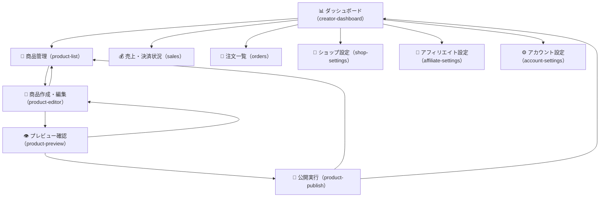

```mermaid
graph TD
  %% ===== クリエイター画面フロー（feature対応） =====
  A[📊 ダッシュボード（creator-dashboard）] --> B[🎨 商品管理（product-list）]

  %% 商品作成・編集フロー
  B --> C[🧱 商品作成・編集（product-editor）]
  C --> D[👁 プレビュー確認（product-preview）]
  D --> E[🚀 公開実行（product-publish）]
  E --> B

  %% 売上・注文管理
  A --> F[💰 売上・決済状況（sales）]
  A --> G[📑 注文一覧（orders）]

  %% ショップ設定・アフィリエイト
  A --> H[🏪 ショップ設定（shop-settings）]
  A --> I[🤝 アフィリエイト設定（affiliate-settings）]

  %% 補助・アカウント設定
  A --> J[⚙️ アカウント設定（account-settings）]

  %% 戻り導線
  C --> B
  D --> C
  E --> A

```
